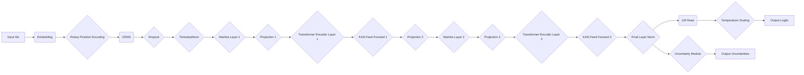

## Class Definitions:

| Class Name | Purpose |
|---|---|
| `UncertainTransformerLightningModule` | PyTorch Lightning module for training the UncertainTransformerLMHeadModel. |
| `UncertainTransformerConfig` | Configuration class for the UncertainTransformerLMHeadModel. |
| `SlimPajamaDataModule` | PyTorch Lightning DataModule for the SlimPajama dataset. |
| `SlimPajamaDataset` | PyTorch IterableDataset for the SlimPajama dataset. |
| `Tokenizer` | Custom Tokenizer class based on GPT2Tokenizer for text preprocessing. |
| `UncertainTransformerLMHeadModel` | The main transformer model with uncertainty estimation. |
| `UncertainNetwork` | Transformer network within the UncertainTransformerLMHeadModel. |
| `UncertaintyModule` | Module for estimating uncertainty using Monte Carlo dropout and Gaussian Processes. |
| `GaussianProcessLayer` | Gaussian Process Layer with data normalization and eigenvalue thresholding. |
| `RandomWalkKernel` | Custom kernel for Gaussian Process based on cosine similarity and random walks. |
| `TemperatureScaling` | Custom function for applying temperature scaling. |
| `ModelNoUncertainty` | A variation of UncertainTransformerLMHeadModel without the uncertainty module for comparison. |

## Tensor Flow:

**Explanation:**

1. **Input Ids:** The input token IDs are passed to the model.
2. **Embedding:** The input IDs are embedded into a vector representation.
3. **Rotary Position Encoding:** Rotary positional embeddings are applied to encode the sequence's positional information.
4. **CEMA:** Cumulative Exponential Moving Average is applied to smooth the hidden states.
5. **Dropout:** Dropout is applied to prevent overfitting.
6. **TimestepNorm:** Timestep normalization is applied to normalize the hidden states across the sequence.
7. **Mamba Layer:** The Mamba state-space model layer is applied to capture long-range dependencies.
8. **Projection:** Linear projections are applied between layers for dimensionality changes.
9. **Transformer Encoder Layer:** The standard transformer encoder layer is applied with multi-head attention and feedforward layers.
10. **KAN Feed Forward:** The KAN feedforward layer is applied to improve model performance.
11. **Final Layer Norm:** Layer normalization is applied to the final hidden states.
12. **LM Head:** The final hidden states are passed through a linear layer (LM Head) to predict the next token's probability distribution.
13. **Temperature Scaling:** Temperature scaling is applied to the logits for improved calibration.
14. **Output Logits:** The temperature-scaled logits represent the predicted probability distribution for the next token.
15. **Uncertainty Module:** The hidden states are passed through the Uncertainty Module to estimate the uncertainty associated with each predicted token.
16. **Output Uncertainties:** The Uncertainty Module outputs a tensor representing the uncertainty values for each predicted token.

**Important Notes:**

* The Mamba layer is optional, and its presence or absence depends on the configuration of the model.
* The Uncertainty Module utilizes both Monte Carlo dropout and Gaussian Processes for uncertainty estimation.
* This diagram depicts the forward pass of the model. The backward pass, involving gradient calculations, is not shown.

